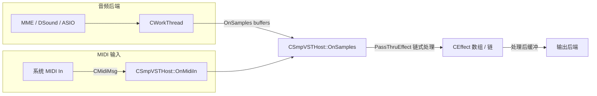

# VST 单插件宿主重构计划书

> 目标：把现有的多插件“VST 机架”改造成**同名自动加载、只支持单个插件**的宿主，支持 VST2 / VST3 / ASIO / JACK 四种接入，JACK 端正确引出 MIDI 与“取决于插件”的实际端口数；同时把用不到的功能砍掉。
>
> 版本：v1.0　|　日期：2026-08-01　|　适用范围：`d:\UserData\Desktop\Project\vsthost`

---

## 1. 背景与目标

### 1.1 现状

当前工程 `vsthost` 是 Hermann Seib 的 **VSTHost 开源版**：

- **MFC MDI 多文档机架**：一个程序可同时加载多个 VST2 插件，并支持“链（Chain）”串联；
- 音频后端：MME（`WaveDev`）、DirectSound（`DSoundDev`）、ASIO（`AsioHost`/`SpecAsioHost`）；
- MIDI：系统 MIDI 输入/输出（`mididev`/`mfcmidi`/`specmidi`）+ 虚拟 MIDI 键盘（`MidiKeybDlg`）；
- 插件封装：`CEffect`/`CVSTHost`（VST2 `AEffect`）与 `CSmpEffect`/`CSmpVSTHost`（宿主扩展）；
- 构建：Visual Studio 2008 工程（`vsthost24.08.vcproj` / `.dsp` 等），VST2 SDK + ASIO SDK，`USE_ASIO` 宏控制。

### 1.2 重构目标

1. **同名自动加载**：把宿主 exe 改名（或拷贝）为与插件同名（如 `MyEffect.dll`/`MyEffect.vst3` → 运行 `MyEffect.exe`），启动时**自动加载同目录下同名插件**，无需手动“文件 → 打开”。
2. **单插件**：去掉机架/多插件/链功能，宿主内永远只有 **1 个插件实例**。
3. **格式**：同时支持 **VST2**（.dll）与 **VST3**（.vst3 模块/目录），并自动识别。
4. **Shell 处理**：**仅当插件文件名包含 `WaveShell`（忽略大小写）时才启用 shell 逻辑**（硬编码识别，见 §5.1）；VST2 Shell（`effShellGetNextPlugin`）与 VST3 多组件模块的**内部效果器选择统一放进主菜单**（“插件 → 内部效果器”），加载时不再弹窗，随时可在菜单里切换（见 §5.9）；并支持**按文件名指定内部插件**：`(Shell文件名)内部插件名.exe`（见 §5.1）。
5. **音频后端**：只保留 **ASIO** 与 **JACK**（删除 MME/DirectSound）。
6. **JACK 正确性**：作为原生 JACK client，**MIDI 端口**与**音频端口数量/通道**都要随插件实际能力动态注册，而不是写死 2 进 2 出。
7. **去冗余**：按 §6 清单删除不用的 UI、对话框、设备后端。
8. 参考/复用第三方 SDK 全部位于 `VST\` 符号链接目录（见 §3）。
9. **双平台编译**：同一源码同时产出 **x86 与 x64** 两个版本（大量现存 VST2 仍是 32 位）。
10. **位数对应加载**：x86 版原生加载 32 位插件、x64 版原生加载 64 位插件；位数不符直接拒绝并提示换用对应版本（进程外桥已废除，见 §5.3.1）。
11. **多实例**：允许**重复打开同一插件**（多个宿主实例同时运行）；检测到已有实例时**提示将当前预设另存为一个新的预设文件**，各实例预设互不覆盖（见 §5.1 / §8）。
12. **DWM 系统风格集成**：对接 **DWM API**，让界面（标题栏深色/浅色、Win11 圆角、系统背景）跟随当前系统风格，并响应系统主题变化（见 §5.9.1）。

---

## 2. 现状代码梳理（改造依据）

### 2.1 关键类与文件

| 层次 | 文件 | 说明 |
|---|---|---|
| 应用 | `vsthost.cpp/h` | `CVsthostApp`：启动、命令行、`LoadEffect()`、Shell 枚举、设置保存 |
| 主窗口 | `MainFrm.cpp/h` | MDI 主框架、工具栏/菜单 |
| 子窗口 | `ChildFrm.cpp/h`、`ChildView.cpp/h` | 每个插件一个 MDI 子窗，链（Chain）逻辑在这 |
| 编辑器 | `EffectWnd.cpp/h`、`EffEditWnd.cpp/h`、`EffSecWnd.cpp/h` | 插件编辑界面窗口 |
| 机架/链 | `EffChainDlg.cpp/h` | 效果链选择对话框 |
| 插件核心 | `CVSTHost.cpp/h`、`SmpVSTHost.cpp/h` | `CVSTHost`（插件数组）、`CEffect`、`CSmpEffect`、`CSmpVSTHost`（采样处理/事件） |
| VST2 封装 | `CVSTHost.h` 内 `CEffect` | 封装 `AEffect` 全部 dispatch |
| MIDI | `mididev.cpp/h`、`mfcmidi.cpp/h`、`specmidi.cpp/h`、`MidiKeybDlg.cpp/h` | MIDI 设备与虚拟键盘 |
| 音频 MME | `WaveDev.cpp/h`、`SpecWave.cpp/h`、`mfcwave.cpp/h` | 将被删除 |
| 音频 DSound | `DSoundDev.cpp/h`、`SpecDSound.cpp/h` | 将被删除 |
| 音频 ASIO | `AsioHost.cpp/h`、`SpecAsioHost.cpp/h`、`AsioChannelSelectDialog.cpp/h` | 保留，改造为后端之一 |
| 工作线程 | `WorkThread.cpp/h` | `CWorkThread`，把后端缓冲送给 `OnSamples` |
| 对话框 | `ShellSelDlg.cpp/h`、`ProgNameDlg.cpp/h` | Shell 选择 / 程序名 |
| 资源 | `vsthost.rc`、`res/`、`resource.h` | 菜单/对话框/图标 |
| 构建 | `vsthost24.08.vcproj`（VS2008）等 | 需迁移到新工具链 |

### 2.2 关键数据流（现状）



### 2.3 现状 Shell 流程（VST2，改造为菜单切换）

`LoadEffect()`（`vsthost.cpp:447`）→ `vstHost.LoadPlugin()` → 若 `EffGetPlugCategory()==kPlugCategShell` 且未指定 UID → `EffGetNextShellPlugin()` 枚举 → `CShellSelDlg` 选择 → 用所选 UID 重新 `LoadPlugin()`。

改造后：**保留 `effShellGetNextPlugin` 枚举机制，去掉 `CShellSelDlg` 弹窗**；枚举结果填充主菜单“内部效果器”子菜单，加载时默认选中“上次选择/第一个”，之后可随时在菜单切换（§5.9）。**Shell 逻辑仅在插件文件名含 `WaveShell` 时启用（§5.1）**。

---

## 3. 第三方资源清单（`VST\` 符号链接）

| 路径（符号链接） | 实际指向 | 版本 | 用途 |
|---|---|---|---|
| `VST\vst2sdk` | `D:\其它\VST\vst2sdk` | VST2 SDK 2.4 | 保留现有 VST2 加载 |
| `VST\vst3sdk` | `D:\其它\VST\vst3sdk` | **VST3 SDK 3.8.0** | 新增 VST3 加载（含官方 hosting 层） |
| `VST\asio` | `D:\其它\VST\asio` | ASIO SDK 2.3 | 保留 ASIO 后端 |
| `VST\JACK2` | `C:\Program Files\JACK2` | **JACK2 1.9.22** | 原生 JACK client（libjack64）+ JackRouter 桥 |

`VST\JACK2` 关键内容：

- `lib\libjack64.lib` + `libjack64.dll`（x64 client 库）；`lib32\libjack.lib`（x86）；
- `include\jack\jack.h`、`midiport.h`、`types.h`、`transport.h`、`weakjack.h` 等（完整 JACK 客户端 API，MIDI 用 `jack_midi_event_*`）；
- `jack-router\win64\JackRouter.dll`（ASIO→JACK 桥驱动，可选路径：不做原生 JACK 时，ASIO 后端也能经由 JackRouter 连到 JACK）；
- `jackd.exe` / `libjackserver64.dll`（JACK 服务器端）。

`VST\vst3sdk` 可直接复用的官方 hosting 代码：

- `public.sdk\source\vst\hosting\module.h/.cpp`（加载 .vst3 模块、枚举 factory class、`createInstance`）；
- `hostclasses.h/.cpp`（`HostApplication`）、`plugprovider.h/.cpp`（`PlugProvider`）、`eventlist.h/.cpp`、`parameterchanges.h/.cpp`、`processdata.h/.cpp`；
- 参考宿主示例：`public.sdk\samples\vst-hosting\audiohost`、`editorhost`（含 `PlugFrame`/编辑器嵌入与媒体后端实现，可对照移植）。

---

## 4. 目标架构总览

```mermaid
flowchart TB
    subgraph APP["app（改名后 = 插件名.exe）"]
        AM[AppMain: 启动→解析自身 exe 文件名→同名自动加载]
        UI[主窗口/单插件编辑窗口]
    end
    subgraph CORE["宿主核心（单插件）"]
        SH[CSingleHost]
        PI[IPlugin 抽象]
        P2[Vst2Plugin]
        P3[Vst3Plugin]
        EN[CEngine 处理引擎]
    end
    subgraph AB["音频后端抽象 IAudioBackend"]
        AS[AsioBackend]
        JK[JackBackend]
    end
    AM --> SH
    UI --> SH
    SH --> PI
    PI --> P2
    PI --> P3
    SH --> EN
    EN --> AB
    AB --> AS
    AB --> JK
    P3 -.->|Hosting::Module / PlugProvider| V3[VST3 SDK 3.8.0]
    P2 -.->|AEffect| V2[VST2 SDK 2.4]
    AS -.->|ASIO SDK| A[ASIO 驱动]
    JK -.->|libjack64| J[JACK2 服务器]
```



要点：

- **后端与插件解耦**：`IPlugin` 只暴露“处理 + 事件 + 参数 + 状态 + 编辑器”，`IAudioBackend` 只暴露“音频/MIDI 缓冲 + 采样率/块大小 + 通道数”。中间由 `CSingleHost`/`CEngine` 桥接。
- **通道数双向传导**：插件决定“要多少通道”（VST2 的 `numInputs/numOutputs`、VST3 的总线布局），后端据此创建缓冲/端口；ASIO/JACK 的实际通道能力反过来约束插件通道（如插件要 8 进 8 出，而 ASIO 只有 2 进 2 出时做映射/提示）。

---

## 5. 详细设计

### 5.1 同名自动加载机制

**规则**（优先级从高到低）：

1. 命令行显式传插件路径：`MyEffect.exe C:\path\plugin.vst3` → 直接加载（兼容旧行为）；
2. 无参数时，读取自身模块名 `GetModuleFileName(NULL)` 取文件名主干 `name`：
   - 优先找 `同目录\name.vst3`（VST3 模块，可能是**目录**或单文件，见下）；
   - 否则找 `同目录\name.dll`（VST2）；
   - 两者都存在时默认 **VST3 优先**，可用配置文件/命令行 `-vst2`、`-vst3` 强制；
   - 精确匹配失败且 `name` 形如 `(Shell文件名)内部插件名` → 按“Shell 内部插件按文件名指定”（见下）解析后再找 shell 文件；
   - 仍找不到 → 弹出文件选择框，并给出提示（“请将本程序改名为插件同名，或直接把插件拖到窗口上”）。
3. 支持把插件文件**拖放**到主窗口完成加载/换插件。
4. **多实例（允许重复开启）**：**不做单实例互斥**——同一插件（含同一 shell 内部插件）可同时打开多个宿主实例；但每次启动时检测“同插件是否已有实例在运行”（`<plugin>.ini` 的 `running` 标记或进程扫描）：
   - 若已有实例 → 弹窗提示：“检测到该插件的另一个实例正在运行。为避免预设文件互相覆盖，请将当前预设**另存为一个新的预设文件**。”默认给出自动递增的新预设名（如 `<plugin> (2).fxp`），可修改；
   - 确认后当前实例改用独立预设文件，各实例预设互不覆盖（仍原子写入，见 §8）。

**VST3 目录形式**：`.vst3` 在 Windows 上通常是**目录**（内含 `.vst3` 文件与 resources），查找时要同时处理“`name.vst3` 目录”和“`name.vst3` 单文件”两种情形。

**换插件语义**：单插件宿主在加载新插件时，先保存旧插件状态 → 卸载 → 加载新插件 → 恢复新插件自己的状态。状态按插件 UID/路径分文件存放（见 §9）。

**Shell 内部插件按文件名指定**：

- **Shell 识别（硬编码）**：仅当目标插件文件名（不含扩展名）**包含 `WaveShell`**（忽略大小写）时，才启用 shell 枚举/内部效果器菜单/文件名解析等全部 shell 逻辑；非 WaveShell 插件即使内部含多个 class 也按普通插件处理（默认加载第一个，不启用内部选择）。**已实测**：`WaveShell1-VST3 16.6_x64.vst3`、`WaveShell1-VST3 16.7_x64.vst3`、`WaveShell1-VST3-ARA 16.7_x64.vst3`、`WaveShell1-VST 16.6_x64.dll`（VST2）等真实文件名均含 `WaveShell`，可直接命中；规则天然覆盖任意版本号与 `_x64`/`_x86` 后缀，无需枚举版本。
- 命名约定：宿主 exe 改为 `(Shell文件名)内部插件名.exe`（例：`(WaveShell1-VST3 16.6_x64)L1 UltraMaximizer.exe`），启动即直接加载 `WaveShell1-VST3 16.6_x64.vst3` 中对应的内部插件，无需进菜单；括号内 `shellName` 精确到版本/架构，多个 WaveShell 版本并存时可指定加载哪一个。
- （可选）`WaveShell1-VST3-ARA` 变体同样命中规则；若暂不支持 ARA 集成，可在识别时排除文件名含 `-ARA` 的模块。
- 解析算法（精确匹配失败后，且目标文件为 WaveShell）：
  1. 若 `name` 以 `(` 开头且含 `)`：`shellName` = 括号内内容，`internal` = 括号后剩余部分；
  2. 找 `同目录\shellName.vst3` / `同目录\shellName.dll`（VST3 优先）；
  3. 加载该 shell 模块并枚举内部效果器（VST2 `effShellGetNextPlugin` / VST3 `classInfos()`）；
  4. 用 `internal` 匹配内部插件名：先忽略大小写精确匹配，再唯一子串匹配；
  5. 命中 → 直接实例化该内部插件；未命中 → 走默认（上次选择/第一个，§5.9）并在日志提示。
- 边界：内部插件名可含空格/`_`（文件名允许空格；为避免歧义，建议内部名不含 `)`）；改名时剔除 `\/:*?"<>|` 等非法字符；`name` 非 `(...)` 形式或 shell 文件不存在的场景自动回退到规则 2 的“找不到”分支。
- **多实例**：`(waves_shell)L1.exe` 与 `(waves_shell)C6.exe` 指向同一 `waves_shell.dll`，**允许同时运行**；按规则 4，后启动的实例提示另存新预设。
- 选定结果照常写入 `last_uid`（§5.9 第 5 点），之后仍可在菜单随时切换。
- **快捷方式生成（方便直选调用）**：
  - 菜单“文件 → 另存为插件快捷方式”：Shell 加载时把当前 exe 复制为 `(Shell文件名)当前内部效果器.exe`（同目录，已存在询问覆盖），以后双击即直选该内部效果器；
  - 命令行批量：`vsthost.exe --gen-shell-exes "<shell路径>" [--out <目录>]` 枚举全部内部效果器，**按声道分文件夹**（9.x/7.x/5.x/Quad/Stereo/Mono/其他，按名称关键词推断）生成 `(Shell名)内部名.exe` + 同名 `.ini`（`[shell2vst] shell=<绝对路径> name=内部名`，**shell 关联用绝对路径**，不复制 shell 副本）；宿主 exe 启动时优先读自身同名 `.ini` 加载 shell 并直选该内部效果器，可放任意位置；
  - 命令行独立插件：`vsthost.exe --shell2vst "<shell路径>" [--out <目录>]` 生成**独立 VST2/VST3 包装器**（类似 shell2vst，约 140KB 模板 DLL），每个内部效果器一个 `.dll`/`.vst3` + 同名 `.ini`（`[shell2vst] shell=<绝对路径> name=内部名`，**shell 关联用绝对路径**，可放任意位置），不复制 shell 副本；VST2 wrapper 经 `audioMasterCurrentId` 返回目标 UID，VST3 wrapper 用 `IPluginFactory` 代理只暴露目标 class；
  - 命名统一走 `HostNaming::MakeShellExeName/SanitizeFileName`（过滤 `\/:*?"<>|` → `_`）；wrapper 模板 `src/wrapper/shell2vst2/3.cpp` + `tools/build_wrappers.ps1` 预编译到 `bin\wrapper\`。

### 5.2 统一插件抽象 `IPlugin`

新建 `src/host/IPlugin.h`，抽象接口（面向 5.7 的处理引擎与 5.9 的 UI）：

```cpp
class IPlugin {
public:
    virtual ~IPlugin() = default;

    // 生命周期
    virtual bool   Init(double sampleRate, int blockSize) = 0; // 含 setup/总线查询
    virtual void   Shutdown() = 0;

    // 音频
    virtual void   Process(float** in, float** out, int frames,
                           int inCh, int outCh, void* events) = 0;
    virtual int    GetInputChannels()  const = 0;
    virtual int    GetOutputChannels() const = 0;
    virtual bool   WantMidiInput()  const = 0; // VST2 receiveVstMidiEvent / VST3 事件总线
    virtual bool   WantMidiOutput() const = 0; // 插件是否能输出事件

    // MIDI / 参数 / 程序
    virtual void   SendMidiIn(const unsigned char* data, int len) = 0;
    virtual int    GetNumParams() const = 0;
    virtual float  GetParam(int idx) const = 0;
    virtual void   SetParam(int idx, float v) = 0;
    virtual void   GetParamName(int idx, char* out, int cap) const = 0;
    virtual void   GetParamDisplay(int idx, char* out, int cap) const = 0;

    // 状态（.fxp/.vstpreset/内部 chunk）
    virtual bool   SaveState(void*& buf, int& size) = 0;
    virtual bool   LoadState(const void* buf, int size) = 0;

    // 编辑器
    virtual bool   HasEditor() const = 0;
    virtual bool   OpenEditor(void* parentHwnd) = 0;
    virtual void   CloseEditor() = 0;
    virtual void   Idle() = 0;
};
```

> 现有 `CEffect` 的 dispatch 封装基本可原样保留，只是从“数组管理”改为“单实例持有”。VST3 封装为新写 `Vst3Plugin`，接口对齐上面这份抽象。

### 5.3 VST2 支持（保留 + 精简）

- 保留 `CEffect`（`CVSTHost.h` 中现有实现）作为 VST2 封装，`Vst2Plugin` 在其上实现 `IPlugin`；
- `LoadPlugin()`（`CVSTHost.cpp:1183`）中“数组槽位分配”逻辑去掉，简化为单实例；
- **Shell 枚举保留、弹窗去除**：**仅当模块文件名包含 `WaveShell` 时**才走 shell 路径——`effShellGetNextPlugin` 枚举子插件名/UID 填充主菜单“内部效果器”子菜单；不再用 `CShellSelDlg` 弹窗，随时在菜单切换（流程见 §5.9）；
- 保留 `EffOpen/EffSetSampleRate/EffSetBlockSize/EffResume/EffSuspend` 的现有初始化顺序（含 11025 大缓冲安全措施与 `receiveVstMidiEvent` 探测）；
- `.fxb/.fxp` 状态读写逻辑（`CVSTHost.cpp` 内 SFx* 结构）保留，作为 VST2 状态保存格式；
- **位数探测与校验**：加载前读 PE 头 `Machine` 字段判断 32/64 位；须与宿主位数一致（x86 宿主加载 32 位、x64 宿主加载 64 位），不符则拒绝并提示换用对应位数版本（见 §5.3.1）。

### 5.3.1 位数对应加载（取代进程外桥）

**背景**：大量现存 VST2 只有 32 位，而 64 位进程无法直接 `LoadLibrary` 32 位 DLL。由于已产出 x86/x64 双版本宿主，**不再需要进程外桥**：

- **x86 版宿主**：原生加载 32 位 VST2/VST3；
- **x64 版宿主**：原生加载 64 位 VST2/VST3；
- **位数不符** → 加载前读 PE 头 `Machine` 字段校验（`IMAGE_FILE_MACHINE_I386`/`IMAGE_FILE_MACHINE_AMD64`），直接拒绝并提示“32 位插件请用 x86 版 vsthost，64 位请用 x64 版”。

> 曾实现 M2b 进程外桥（`--bridge` 模式 + 共享内存 ring/事件 + `Vst2PluginBridge`），因加载后 UI 周期性卡顿（桥 Idle 跨进程等待）且双版本已覆盖需求，**已整体移除**（`src\bridge` 删除）。

### 5.4 VST3 支持（新增，重点）

基于 `VST\vst3sdk\public.sdk\source\vst\hosting`，新增 `Vst3Plugin`：

1. **加载模块**：`Hosting::Module::create(path)`（Win32 用 `LoadLibrary` 加载，见 `module_win32.cpp`）。
2. **枚举组件（含 shell 场景）**：遍历 `module->getFactory().classInfos()`，取 `kVstAudioEffectClass` 且 `category == "Audio Effect" | "Instrument" | "Fx"` 的 class。
   - 恰 1 个 → 直接实例化；
   - **多个 → 仅当模块文件名包含 `WaveShell` 时才启用内部选择**：不弹窗，把所有组件名（`classInfo.name()`）与 uid 填入主菜单“内部效果器”子菜单；默认实例化“上次选择/第一个”，之后随时在菜单切换（流程见 §5.9）；非 WaveShell 的多组件模块按普通插件处理（默认第一个）。
   - 这一步即满足“VST3 为 shell（WaveShell）时提供内部效果器选择（菜单化）”。
3. **实例化与初始化**：
   - `module->createInstance(uid, IComponent::iid, ...)` 与 `IEditController`；
   - `IComponent::initialize(hostContext)`（用 `Hosting::HostApplication` 作 `IHostApplication`）；
   - `IComponent::setActive(true)`、`IAudioProcessor::setupProcessing(ProcessSetup{..})`；
   - 查询总线：`IComponent::getBusCount(kAudio, kInput/kOutput)` + `getBusInfo()` → 汇总**实际输入/输出通道数**（供 5.6 JACK 端口与 5.5 ASIO 缓冲使用）。
4. **处理**：构造 `ProcessData`（`ProcessData.h` 提供的 helpers 分配 `AudioBusBuffers`），`processData.inputs/outputs` 按总线数/通道数填充，`numSamples = frames`，事件走 `EventList`、参数走 `ParameterChanges`（`ParameterChanges.h` 的容器可复用）。
5. **参数**：`IEditController::getParamCount/getParamInfo/getParamString/...` 与 `IParameterChanges` 双向映射（宿主自动化 → `IParamValueQueue`）。
6. **MIDI**：`EventList` 转 VST3 `Event`（`kNoteOnEvent/kNoteOffEvent/kDataEvent/kPitchBendEvent/kPolyPressureEvent/kProgramChangeEvent/kAfterTouchEvent/kChannelPressureEvent`），经 `IEventList::addEvent` 送入 `process()`；插件输出的 `EventList` 读回转发给后端 MIDI 输出。
7. **编辑器**：`IEditController::createView(PlugView::kEditor)` → `IPlugView::attach(parent, Frame)`，实现 `IPlugFrame`（参考 `editorhost`/`audiohost` 的 `PlugFrame` 类：`resizeView` 回调宿主窗口缩放），嵌入到单插件主窗口客户区；`IPlugView::onSize/onFocus/onKeyDown` 等消息转发。
8. **状态**：`IComponent::getState/setState` 经 `MemoryStream`（`base/source`）读写，作为 VST3 状态保存格式。
9. **实时约束**：process 回调线程内禁止 COM/加载/分配/日志，与 VST2 处理线程同一套纪律（现有 `EnterCriticalSection` 策略沿用）。

### 5.5 音频后端抽象与 ASIO

新建 `IAudioBackend`：

```cpp
class IAudioBackend {
public:
    virtual ~IAudioBackend() = default;
    virtual bool   Open(double wantRate, int wantBufSize, int wantIn, int wantOut) = 0;
    virtual void   Close() = 0;
    virtual bool   Start() = 0;
    virtual void   Stop() = 0;
    virtual double GetSampleRate() const = 0;
    virtual int    GetBufferSize() const = 0;
    virtual int    GetInputChannels() const = 0;
    virtual int    GetOutputChannels() const = 0;
    // 后端把每块数据（含 MIDI）交给引擎
    virtual void   SetProcessCallback(void (*cb)(void* ctx, float** in, float** out,
                                                 int frames, void* midiIn, void* midiOut), void* ctx) = 0;
};
```

**AsioBackend**：包装现有 `CAsioHost`/`CSpecAsioHost`（`AsioHost.cpp` 的 `LoadDriver/Init/CreateBuffers/bufferSwitchTimeInfo` 流程基本不动）：

- 驱动列表枚举（现有 `CSpecAsioHost::GetDriverNames`）保留，配置记忆上次驱动；
- 缓冲转换（`ConvertFromASIO/ConvertToASIO`，支持 Int16/24/32/Float32/64、大小端）原样保留；
- 采样率/块大小取驱动实际值并同步给插件（`EffSetSampleRate/EffSetBlockSize` / VST3 `ProcessSetup`）；
- 输入/输出通道数取 `ASIOGetChannels`，与插件通道数做映射：
  - 后端 ≥ 插件 → 用后 端前 N 通道；
  - 后端 < 插件 → 用 0 填充输入、丢弃多余输出，并 UI 提示；
- **`AsioChannelSelectDialog` 保留**（用户明确要求）：
  - 在单插件场景下，对话框用于**手动指定 ASIO 通道 ↔ 插件通道的映射**（如把 ASIO 的 in_3/in_4 映射到插件的输入 1/2），不依赖自动取前 N 路；
  - 对话框默认按插件通道数预填映射，用户可改；选择结果存配置（`<plugin>.ini` 的 `[AsioMap]`）；
  - 映射结果供 `AsioBackend` 的缓冲搬运使用（替换“自动取前 N 通道”逻辑，作为可选项）。
- 可选：ASIO 驱动选 **JackRouter** 时即“ASIO→JACK 桥”方案（`VST\JACK2\jack-router`），可作为原生 JACK 之外的第二条路，但非主线。

**M4 已实现（✅ 2026-08-01 实测）**：

- 新增 `src/host/IAudioBackend.h`（Open/Close/Start/Stop/GetSampleRate/GetBufferSize/GetInputChannels/GetOutputChannels/GetDriverName/SetProcessCallback）与 `src/host/AsioBackend.h/.cpp`（基于 ASIO SDK 的 `asiodrivers.cpp`+`asiolist.cpp`+`asio.cpp`，编入工程；`asiolist.cpp` 的注册表 API 改为显式 A 版本以适配 Unicode 编译）。
- **默认设备 = FL Studio ASIO**（用户要求：避免抢占其他 DAW 正在用的 ASIO 硬件驱动）：`PickDefaultDriver()` 优先级 = 配置记忆 `[asio] driver=` → `FL Studio ASIO` → 第一个可用；配置存 exe 同目录 `<exe名>.ini`（与 `[shell2vst]` 共用，快捷方式 exe 同样生效）。
- 缓冲转换：Int16/24/32(含 16/18/20/24bit 左对齐)/Float32/64、大小端（移植自 `AsioHost.cpp`）。
- 采样率/块大小取驱动实际值并同步插件：`IPlugin::ReconfigureAudio(rate,size)`（新增虚方法，VST2 = SetSampleRate+Suspend/SetBlockSize/Resume 不动编辑器；VST3 = deactivate→setupProcessing→activate）。
- 通道映射（ASIO 实时回调 `CMainFrame::AsioProcessCB`）：后端 ≥ 插件 → 取前 N；后端 < 插件 → 输入补 0、多余输出丢弃（回调前输出缓冲已清零）。
- 菜单“音频→ASIO 设备（勾选当前）/驱动控制面板/刷新设备列表”；加载插件后自动 `StartAudio()`，关闭/切换内部效果器前先 `StopAudio()`（实时线程安全）；状态栏显示 `X 进 / Y 出 · ASIO: <驱动> <采样率>Hz / <块> 帧`。
- 实测（16.6 shell → Magma StressBox Mono，FL Studio ASIO）：ini 写入 `[asio] driver=FL Studio ASIO`；CPU 8s +906ms vs 空宿主 0ms（ASIO 实时回调在跑）。
- **通道分配（M4.1 ✅）**：菜单“音频→ASIO 通道分配”打开 `AsioMapDialog`（`src/app/AsioMapDlg.h/.cpp`，动态模板无 .rc 依赖）；插件通道↔ASIO 通道映射存 ini `[AsioMap] in=/out=`（逗号分隔 ASIO 索引，-1=静音/丢弃），`AsioProcessCB` 按映射搬运。
- **DSP 使用率（✅）**：`AsioBackend` 用 `QueryPerformanceCounter` 统计处理耗时（`GetDspLoad()`≈processTime×100/(elapsed×采样率/块)），状态栏每 500ms 刷新 `DSP xx%`。
- **垂直电平表（✅，用户改版）**：菜单“视图→显示电平表”（`[View] meters` 记忆开关）；ASIO 回调采集每通道峰值；**左右边缘垂直电平条**（I 左 / O 右，标题居中，每通道 22px，最多 16 通道，**高度随窗口高度自适应**），**dB 刻度 -60~+12（0dB 以上红区 / 黄 -9~0 / 绿 -60~-9）**，每条底部独立 dB 数值框（无信号显示 `-Inf`），峰值保持线（2px 白线，可开关）；`OnTimer` 只失效左右条带区域。

**M4.2 电平表/响度增强（✅ 2026-08-01 全部完成并实测）**：

- **✅ 音频通路修复（关键排障）**：
  - **FlexASIO 输入握手**：FlexASIO 依赖宿主每块调 `ASIOOutputReady()`（否则第二轮 bufferSwitch 后回调线程死锁、输入输出全停摆）——`BufferSwitchTimeInfo` 末尾总是调用（删除原先 createBuffers 前的探测，`m_postOutput` 成员已删）。用户确认输入已通。
  - **VST3 输出总线激活**：Waves 等严格插件只处理宿主 `activateBus` 激活的总线——`Vst3Plugin::SetupAudio()` 在 `setActive(true)` 前遍历 2 media（kAudio/kEvent）× 2 dir（kInput/kOutput）激活全部总线（否则 `process()` 返回成功但输出缓冲全 0）。用户确认音频通路正常。
- **电平表平滑**：ASIO 回调包络平滑（条 attack τ≈30ms / release τ≈80ms；峰值线上升 att、下降 τ=峰值保持时长），静音归零（<-60dB 直接置 0）。
- **峰值保持时长**：`[View] peakhold`（关闭/0.5/1/2/5 秒，默认 1s）；**峰值线/数值框开关**：`[View] peakline`、`[View] metervalue`。
- **刷新频率设置**：`[View] meterrefresh`（30~200ms，默认 50）；**定时器拆分**：timer1=插件 idle（50ms）/ timer2=电平表刷新（可配）/ timer3=CSV 采样（可配）。
- **独立电平表窗口（`src/ui/LevelMeterDlg`，无模式自绘）**：
  - 左区 **I/O 峰值**：左输入右输出、栏宽按通道数比例、每条独立 dB 数值框（-60~+12 刻度、0dB 以上红）；
  - 右区 **Momentary / Short-term / Integrated / LRA / True Peak 五列**（等宽居中、列间分隔线）；
  - 响度标准切换（**红色参考线覆盖 M/S/I** + 参考值在左端）、响度源切换（输出/输入，默认输出）；
  - M/S/I 分段：绿 ≤ 参考线 / 黄 参考线~-5 / 红 ≥-5；
  - **True Peak**：dBTP（-60~+12），黄区起点=标准真峰值上限，红色参考线 + 参考值在右端空白区；
  - 操作栏：标准下拉 / 输出·输入单选 / 重置 I（等宽等高对齐）。
- **响度核心（`src/dsp/LoudnessCore`）**：ITU-R BS.1770-4 K 权重（48k 系数）+ 分块 gating（M=400ms、S=3s、I=两层门、LRA=10%~95% 百分位）；**静音阈值可设**（`[View] silence_thresh`，默认 -70）；**静音重置时长**（`[View] lra_silreset`，默认 10s）；**每次彻底静音仅重置一次**（持续静音不反复重置，重新有信号后才重新计时）；`AutoResetCount()` 供宿主检测。
- **响度标准（`src/ui/loudness_std.h`）**：10 项含平台参考（BS.1770-4 / EBU R128 / ATSC A/85 / Bilibili -16 / YouTube -14 / TikTok -14 / Apple Music -16 / Spotify -14 / QQ·网易云 -14 / 电影院线 -27）+ **真峰值上限 tpLimit**（BS.1770·EBU·平台 -1 / ATSC -2 / 影院 -0.1 dBTP），`[View] loudnessstd`。
- **电平表设置窗口（`src/ui/MeterSettingsDlg`，模态）**：集中所有设置；数值项（刷新频率/峰值保持/静音重置/静音阈值/CSV 间隔）用**滑块 + 输入框**（拖动或直接输入，自动钳制对齐步进）；响度标准下拉、开关类 CheckBox。
- **CSV 响度日志**：`[View] csvlog / csvinterval / csvfolder`；timer3 按间隔写 `Time,In_M/S/I/LRA/TP,Out_M/S/I/LRA/TP`（UTF-8）；**文件名 = 当前系统时间 `loudness_YYYYMMDD_HHMMSS.csv`**；**自动（检测 AutoResetCount）或手动重置后直接开新文件**；输出文件夹经系统文件夹选择对话框（IFileDialog）。
- **测试信号**：菜单“插件→测试信号：1kHz 正弦”（toggle），覆盖所有输入通道验证音频通路。
- **持久测试 exe 体系**：`test_exe\`（Mono/Stereo/5.x×3/7.1 快捷方式 exe + ini，默认 FL Studio ASIO）+ `tools\refresh_test_exes.ps1`（cmd /c 调用刷新）。

**M4.3 宿主增强（✅ 2026-08-01 全部完成并实测）**：

- **ASIO 采样率 / 缓冲 / MIDI 输入设置**：菜单"音频→采样率/缓冲/MIDI 输入"打开 `AsioSettingsDlg`（采样率/缓冲可编辑 Combo，默认=ini 记忆或当前驱动实际值；MIDI 启用+设备 Combo+**MIDI 通道 Omni/1~16**）；`ApplyAsioSettings` 写 ini `[asio] samplerate/buffersize/midiinput/mididevice/midichannel`，音频运行则重启生效。
- **MIDI 输入接入（`src/host/MidiInput`，winmm）**：midiInOpen CALLBACK_FUNCTION + 临界区队列；ASIO 实时回调按 `m_midiChannel` 过滤（0=Omni）后 `SendMidiIn`（VST2 填 VstMidiEvent slot / VST3 转 EventList），同一实时线程安全。
- **MIDI 参数映射（`src/ui/MidiMapDialog`）**：菜单"插件→MIDI 参数映射"；CC→插件参数映射（`[MidiMap] mapN=ch,cc,param`），实时回调查表 `SetParam`（VST2 EffSetParameter / VST3 setParamNormalized+ParameterChanges），外部控制器可调插件参数。
- **VSTi 乐器支持**：`IPlugin::IsInstrument()`（VST2 `effFlagsIsSynth` / VST3 subCategories 含 "Instrument"）；乐器不显示输入电平表；`test_exe\VSTi\`（x86 宿主+32 位 VST2 乐器 DSK AkoustiK KeyZ）实测可弹。
- **托盘 + 关闭行为 + 全局设置**：最小化到托盘（NOTIFYICONDATA + WM_TRAYICON，左键/双击恢复、右键菜单显示/退出）；关闭询问框（最小化到托盘/完全关闭 + 不再提示，`[View] closeaction` 0=询问/1=托盘/2=关闭）；**全局设置对话框 `GlobalSettingsDlg`（关闭行为 + 音频/MIDI 设置，原 AsioSettingsDlg 并入并删除）**；文件→退出直接退出。
- **待办**：M5 JACK 后端（端口随插件、MIDI 输出事件需补）；M6 收尾（VST3 shell 状态按 uid 分档、`pack.ps1`）。

### 5.6 JACK 后端（新增，重点：MIDI + 实际接口数）

基于 `libjack64`（动态链接，缺失 `libjack64.dll` 时给出“请安装/启动 JACK2”提示），新增 `JackBackend`。**核心要求：端口数量/类型由插件实际能力决定**。

**流程**：

1. `jack_client_open(clientName, JackNullOption | JackNoStartServer, ...)`；
   - `clientName` 用 `ComputeHostName()`（与窗口标题同源）：`<插件名/exe 文件名>_<实例序号>`（同名插件多实例时 `_1`、`_2`…递增，保证 JACK 客户端名唯一），便于 JACK 图里识别。
2. **注册音频端口（数量取决于插件）**：
   - 查询 `IPlugin::GetInputChannels()/GetOutputChannels()`（VST2 的 `numInputs/numOutputs`；VST3 的总线汇总）；
   - `for i in 0..inCh-1: jack_port_register(client, "in_i+1", JACK_DEFAULT_AUDIO_TYPE, JackPortIsInput, 0)`；
   - `for i in 0..outCh-1: jack_port_register(client, "out_i+1", JACK_DEFAULT_AUDIO_TYPE, JackPortIsOutput, 0)`；
   - 端口名规范：`pluginname:in_1 .. in_N` / `out_1 .. out_M`（N、M 即插件实际接口数，**不是写死的 2**）。
3. **注册 MIDI 端口**：
   - 若 `IPlugin::WantMidiInput()`（VST2 `receiveVstMidiEvent` / VST3 有事件输入总线）→ 注册 `midi_in`（`JACK_DEFAULT_MIDI_TYPE`, `JackPortIsInput`）；
   - 若 `IPlugin::WantMidiOutput()`（VST2 `sendVstMidiEvent` / VST3 事件输出总线）→ 注册 `midi_out`（`JackPortIsOutput`）；
   - 即：**MIDI 端口存在与否、数量都随插件**。
4. **process 回调**（JACK 实时线程直接驱动，不再另起工作线程）：
   - `jack_set_process_callback` → 回调里：
     - `jack_port_get_buffer` 取各音频端口 → 组装 `float** in/out`（JACK 样本本来就是 float32，无需转换）；
     - 读 MIDI：`jack_midi_get_event_count/jack_midi_event_get` → 逐条转 VST2 `VstMidiEvent`（填 `VstEvents`）或 VST3 `EventList`；
     - 调 `CEngine::Process(...)`；
     - 写 MIDI 输出：插件产生的事件 → `jack_midi_clear_buffer` + `jack_midi_event_write`。
5. **采样率/块大小**：
   - `jack_get_sample_rate()` → 同步插件；
   - `jack_get_buffer_size()`；`jack_set_buffer_size_callback` 处理块大小变化（重新 `setupProcessing`）。
6. **连接**：默认不自动接线；可在配置里开 `auto_connect=1`（参考 `JackRouter.ini` 的 `[AUTO_CONNECT]`），用 `jack_connect` 连到 system capture/playback 与输入 MIDI 设备。
7. **生命周期**：`jack_activate` 后开始；`jack_deactivate/jack_client_close` 停止；`jack_on_shutdown` 处理服务器退出（弹提示并停引擎）。

**关键正确性点（验收项）**：

- 2 进 2 出插件 → JACK 上出现 `in_1,in_2,out_1,out_2` + `midi_in`；
- 16 进 16 出、或 VST3 多总线（如 2×8）插件 → 端口数跟随总线展开；
- 无 MIDI 能力的插件（如纯 FX）→ **不注册** midi_in/midi_out（不产生多余端口）；
- 乐器类插件 → `midi_in` 必须有、`midi_out` 按插件是否输出事件决定。

**M5 已实现（✅ 2026-08-01 实测通过，Carla 中多实例同跑）**：

- 新增 `src/host/JackBackend.h/.cpp`：**动态链接 libjack64/libjack**（`LoadLibraryW` + `GetProcAddress`，宏 `JACK_MEMBER`/`JACK_LOAD` 批量声明/加载函数指针；**缺失 dll 时提示“请安装/启动 JACK2”，无需链接 import lib，双平台通吃**；`VST\JACK2\include` 已在工程 include 路径）。实现 `IAudioBackend`。
- **端口随插件能力**：`Open(clientName, …)` 时按 `IPlugin::GetInputChannels()/GetOutputChannels()` 注册 `in_1..N` / `out_1..M`（音频），按 `WantMidiInput()/WantMidiOutput()` 注册 `midi_in` / `midi_out`（`SetMidiPorts` 在 Open 前设置）。
- **process 回调直接驱动**（`jack_set_process_callback`，JACK 实时线程）：取音频端口缓冲（float32 直用，输出先清零）→ 读 `midi_in`（`jack_midi_get_event_count/jack_midi_event_get`，短消息存固定数组）→ `midi_out` 缓冲 `jack_midi_clear_buffer` → 调共用 `CMainFrame::AudioProcessCB`（JACK 收集的 MIDI 事件 + MME 队列统一走 `ProcessMidiEvent`：通道过滤 + CC 映射 + `SendMidiIn`）→ **插件 MIDI 输出事件经 `IPlugin::CollectMidiOut`（VST2 `audioMasterProcessEvents` / VST3 输出 `EventList` 收集）由 `CJackBackend::WriteMidiOut` 用 `jack_midi_event_write` 写入 `midi_out`**（音符/复音压力；VST3 SDK 3.8.0 的 CC/弯音走 ParameterChanges 无通道信息，暂不收集）。
- **生命周期**：`Start`=jack_activate / `Stop`=jack_deactivate / `Close`=jack_client_close；`jack_on_shutdown`→PostMessage 到宿主（`WM_JACK_SHUTDOWN`）→UI 线程停音频+提示；`jack_set_buffer_size_callback`→`WM_JACK_BUFSIZE`→重启音频重新 `setupProcessing`；采样率/块大小取 `jack_get_sample_rate/jack_get_buffer_size` 并 `ReconfigureAudio` 同步插件。
- **后端切换（菜单“音频→使用 ASIO / 使用 JACK”Radio）**：ini `[View] backend`（0=ASIO 默认 1=JACK）；`StartAudio` 按 `m_backendMode` 分发 `StartAsioAudio`/`StartJackAudio`，`m_pBackend`（IAudioBackend*）指向当前活跃后端供回调取采样率；**启动目标后端前先 `Close()` 另一后端（两后端严格互斥，JACK 下 ASIO 驱动彻底释放不传输）**；JACK 下清空 ASIO 通道映射残留（端口数=插件通道数直通）。客户端名 = **当前插件名 `GetStateBase()`**（窗口标题同源，如 `Magma StressBox Stereo_1`；不用超长 exe 名避免 JACK 27 字符硬限制截断）。状态栏 JACK 时显示 `JACK: <客户端名>`；**DSP 使用率**（QueryPerformanceCounter 计时）状态栏与“关于插件”均显示。
- **启动自动检测**：`[View] backend` 未配置时 `CJackBackend::ServerAvailable()` 探测，JACK 服务器在运行 → 默认直接 JACK 并回写 ini。
- **JACK 未运行 → 回退 ASIO（✅）**：`StartJackAudio()` 返回 bool；lib 缺失 / 服务器未运行 / 打开或启动失败一律 `false`，`StartAudio` 收到 `false` 即自动改启 ASIO 并提示“JACK 未运行（或未找到 libjack64.dll），已回退到 ASIO”。
- **排障经验**：①JACK 激活时会回调 buffer size 当前值，`OnJackBufsize` 需双层防抖（`m_notifiedBufsize` 相同值忽略 + Close 清通知 + UI 500ms 时间窗）否则无限重启死循环；②`InvalidateMeters` 不得只查 ASIO，需查当前后端否则 JACK 下主窗口电平表不重绘；③JACK 下清空 ASIO 通道映射残留（端口数=插件通道数直通）。
- **实测（2026-08-01）**：Carla 中 4 个宿主实例同跑（`Bidule` / `Magma StressBox Stereo_1` / `B360 5.0/Quad_1` / `DSK AkoustiK KeyZ_1`），端口数随插件、客户端名唯一、电平表/DSP 正常，patchbay 中蓝线连接清晰。

### 5.7 处理引擎 `CEngine`

- 替代“`CWorkThread` + `CSmpVSTHost::OnSamples` 链式处理”的多插件路径；
- 单一处理函数 `CEngine::Process(float** in, float** out, int frames, void* midiIn, void* midiOut)`：
  1. 把 `midiIn` 转成 `IPlugin::SendMidiIn`（VST2：构建 `VstEvents`；VST3：`EventList`）；
  2. `plugin->Process(in, out, frames, inCh, outCh, events)`；
  3. 把插件输出事件收集到 `midiOut`；
  4. 若插件 `WantMidiInput()` 且后端无 MIDI（如 ASIO 无 MIDI 时）→ 可选内部软路由（保留 `specmidi` 的 MME MIDI 输入作为 JACK/ASIO 之外的 MIDI 来源，见 5.8）。
- 处理线程纪律沿用：UI 线程与实时线程之间的参数/状态访问用临界区（现有 `CSmpEffect::EnterCritical/LeaveCritical` 模式）。

### 5.8 MIDI 输入/输出

- **后端自带 MIDI**：JACK 后端走 JACK MIDI 端口（主线，满足“JACK 引出 MIDI”）；
- **系统 MIDI（MME）**：`mididev/specmidi/mfcmidi` 保留为**可选的 MIDI 输入来源**（当后端不是 JACK 时，ASIO 没有 MIDI，需要它给乐器插件送音符），默认关闭、可配置；
- **MIDI 输出**：插件产生的事件 → JACK `midi_out`；后端不是 JACK 时经 MME MIDI Out 送出（可选）；
- **虚拟 MIDI 键盘 `MidiKeybDlg`**：属于“用不到”范畴 → 删除（见 §6），需要测试音符时用外部 MIDI 键盘/软音源经 JACK 或 MME 输入。

### 5.9 UI 精简设计

- **MDI → SDI**：主框架改为单文档/单窗口（保留 `CMainFrame` 外壳，去掉 `CChildFrame` 的多文档与链逻辑）；
- **窗口标题**：`ComputeHostName()` = `<插件名/exe 文件名>_<实例序号>`（同名插件重复开启时 `_1`、`_2`…递增；该名字同时作为 JACK 客户端名，见 §5.6）。**加载插件后标题改为 `GetStateBase()` = `<当前插件名>_<实例序号>`**：普通插件用插件文件名（模块主干），**Shell（多组件）用当前内部效果器名**（如 `(WaveShell...)API-560 Stereo.exe` → 标题 `API-560 Stereo_1`）；菜单切换内部效果器后标题随之更新；预设文件同名分档（见 §8）。
- **单插件编辑器窗口**：主窗口客户区直接嵌入插件编辑器（VST2 的 `EffEditOpen` 子窗口 / VST3 的 `IPlugView`），不再为“每个插件开一个 MDI 子窗”；
- 保留（改造）：
  - 菜单：打开/关闭插件、参数/程序菜单（`FillPopup` 逻辑保留）、后端选择（ASIO 驱动 / JACK）、设置；
  - **“内部效果器”子菜单**（Shell 随时切换，见下）；
  - **`AsioChannelSelectDialog`**（ASIO 通道映射，保留并适配单插件）；
  - 状态栏（采样率/块大小/通道数/CPU）。
- **删除**：见 §6（`ShellSelDlg`/`Vst3ShellSelDlg` 弹窗不再需要，由菜单承担）。

**内部效果器菜单切换（VST2 Shell / VST3 多组件通用）**：

1. **枚举入菜单（仅 WaveShell）**：模块加载后，仅当文件名含 `WaveShell` 时才枚举全部内部效果器（VST2 `effShellGetNextPlugin` / VST3 `classInfos()`），按“插件 → 内部效果器”生成单选子菜单（当前项打勾；数量多时参照 `FillPopup` 16 个一组分页）。
2. **加载默认**：默认实例化“上次选择（§8 配置）或第一个”，**不再弹选择框**；若 exe 文件名带 `_内部插件名` 后缀（§5.1“Shell 内部插件按文件名指定”）则直接命中该内部插件；如需保留“首次加载弹窗确认”，配置 `prompt_on_load=1`（可选）。
3. **随时切换流程**（点击菜单项）：
   - 停引擎（或临界区同步）；
   - 保存当前内部效果器状态（按 uid 分档，见 §8）；
   - 卸载当前实例（VST2 `EffClose`/`Unload`；VST3 `setActive(false)`/`release`）；
   - 从**同一已加载模块**实例化所选 uid（VST2 同一 DLL 重新 `LoadPlugin(uid)`；VST3 同一 module `createInstance(uid)`）；
   - 恢复该 uid 上次保存的状态（若存在）；
   - **重建后端连接**：重新查询插件通道数，JACK 按新接口数重建端口（§5.6）、ASIO 重建通道映射（§5.5）；
   - 重启引擎。
4. **状态隔离**：每个内部效果器状态独立存 `<plugin>.<uid>.fxp` / `<plugin>.<uid>.vstpreset`，互不覆盖。

### 5.9.1 DWM 系统风格集成（目标 12）

- **目标**：界面风格跟随当前系统（Windows 10/11）：
  - 标题栏深色/浅色跟随系统设置 —— `DwmSetWindowAttribute(DWMWA_USE_IMMERSIVE_DARK_MODE, 20)`（Win10 1903+）；
  - Win11 窗口圆角 —— `DWMWA_WINDOW_CORNER_PREFERENCE`（`DWMWCP_ROUND`）；
  - （可选/延伸）Mica 背景 —— `DWMWA_SYSTEMBACKDROP_TYPE = DWMSBT_MAINWINDOW`（Win11 22H2+）；当前插件编辑器区不透明，Mica 仅用于无内容区域，留作后续增强。
- **主题检测与跟随**：读取注册表 `HKCU\...\Themes\Personalize\AppsUseLightTheme`（0=深色）；监听 `WM_SETTINGCHANGE`（`ImmersiveColorSet`）动态重设 DWM 属性并重绘占位面板/状态栏。
- **占位面板/状态栏深色适配**：`CPluginHostView` 按主题切换底色与文字色（深色时用深灰底+浅字），插件编辑器子窗口保持不透明不受影响。
- **兼容性**：`Dwmapi.lib` 链接；DWM 属性失败一律静默降级（旧系统/关闭合成时保持默认外观）；新 SDK 常量已内建，无需条件定义。
5. **持久保存（跨会话 / 防冲突）**：
   - `last_uid`（上次选择的内部效果器）写入 `<plugin>.ini`，启动时按它恢复，重启宿主不丢选择；
   - 保存时机：切换时、关闭插件、退出，以及**定时自动保存**（如每 30s，防崩溃丢失）；
   - **原子写入**：先写 `*.tmp` 再 `MoveFileEx(..., MOVEFILE_REPLACE_EXISTING)` 改名，杜绝写入中断产生的半截/损坏文件。
6. **多实例与预设隔离**：
   - **允许重复开启**：同一插件（含同一 shell 内部插件）可同时运行多个宿主实例，不做互斥拦截（§5.1 规则 4）；
   - 启动时检测到已有同插件实例 → **提示另存为一个新的预设文件**（自动递增命名，如 `<plugin> (2).fxp`，可改），当前实例改用独立预设读写，互不覆盖；
   - 各实例仍原子写入各自预设/状态文件；`<plugin>.ini` 的通用项（如 `last_uid`）允许最后写者胜（低风险）。

---

## 6. 删除清单（去掉用不到的东西）

| 项 | 文件 | 理由 |
|---|---|---|
| 多插件数组/机架 | `CVSTHost` 的 `aEffects/naEffects/nmaEffects/LoadPlugin/RemoveAt/RemoveAll` 数组逻辑 | 只支持单插件 |
| 链（Chain）功能 | `EffChainDlg.*`、`CEffect::InsertIntoChain/RemoveFromChain/GetPrev/GetNext`、`ChildFrm` 的 Chain 菜单/处理 | 单插件无链 |
| 多文档子窗口 | `ChildFrm.*`、`ChildView.*` 的多文档/链部分 | 改 SDI |
| 分节视图 | `EffSecWnd.*` | 与单窗口编辑冲突 |
| 编辑器双窗口 | `EffectWnd.*`/`EffEditWnd.*` 可合并为单一编辑器宿主 | 单插件只需一个编辑区 |
| 虚拟 MIDI 键盘 | `MidiKeybDlg.*`、相关菜单/资源 | 用不到（外部 MIDI/JACK 输入代替） |
| MME 音频输出 | `WaveDev.*`、`SpecWave.*`、`mfcwave.*` | 只保留 ASIO/JACK |
| DirectSound | `DSoundDev.*`、`SpecDSound.*` | 只保留 ASIO/JACK |
| Shell 弹窗 | `ShellSelDlg.*`（VST2）、计划中的 `Vst3ShellSelDlg`（不再新建） | 内部效果器选择改为主菜单“内部效果器”子菜单（§5.9） |
| 程序名对话框 | `ProgNameDlg.*`（可保留，低优先） | 单插件仍可能用到，保留可选 |
| 多余对话框资源 | `vsthost.rc` 中链/键盘相关 `IDD_*` | 随上述删除（ASIO 通道选择对话框及其资源**保留**） |
| 旧构建工程 | `vsthost.08.*`、`vsthost23.*`、`vsthost24.*` 的 `.sln/.vcproj/.dsp/.dsw` | 迁移到单一新工程 |
| 其它 | `ChildView` 中仅机架用的显示逻辑、未用命令/快捷键 | 代码清扫 |

> 原则：**凡是不服务于“单插件 + VST2/VST3 + ASIO/JACK”的代码一律移除**；被删除文件不再加入新工程。

---

## 7. 构建系统改造

### 7.1 工程迁移

- 从 VS2008 `.vcproj` 迁移到 **Visual Studio 2022 `.vcxproj`**（`vst3sdk 3.8.0` 要求较新工具链/CMake ≥ 3.25，可直接用其 CMake 或手工工程引用源码）。
- **双平台**：同一 `.sln/.vcxproj` 同时配置 **Win32（x86）与 x64** 两个平台，共享全部源码（见 §7.4）。
- 产出物：`vsthost.exe`（发布时按 §5.1 改名为 `<plugin>.exe`）。

### 7.2 包含目录（相对 `VST\` 符号链接，不拷贝 SDK）

```
VST\vst2sdk\pluginterfaces\vst2.x
VST\vst2sdk\public.sdk\source\vst2.x
VST\asio\common
VST\asio\host
VST\asio\host\pc
VST\vst3sdk                      (及 public.sdk\source\vst\hosting 等)
VST\vst3sdk\base
VST\vst3sdk\pluginterfaces
VST\JACK2\include                (jack.h / midiport.h)
```

### 7.3 链接

- `winmm.lib`（保留，MME MIDI 用）；
- JACK：优先**动态加载**（`LoadLibrary` + `GetProcAddress`，参考 `weakjack.h` 的弱链接思路），避免无 JACK 时程序无法启动：
  - x64 → 运行时 `libjack64.dll`，静态备用 `VST\JACK2\lib\libjack64.lib`；
  - x86 → 运行时 `libjack.dll`，静态备用 `VST\JACK2\lib32\libjack.lib`；
- 其余 SDK（vst2sdk / vst3sdk 3.8.0 / asiosdk 2.3）均可同时编译 x86 与 x64。

### 7.4 双平台产出与发布

- 同一源码两套产出：
  - `bin\x64\vsthost.exe` —— x64 宿主（原生：64 位 VST2/VST3）；
  - `bin\x86\vsthost.exe` —— x86 宿主（原生：32 位 VST2 / 32 位 VST3）；
- 打包脚本 `tools\pack.ps1`：按“同名”规则把对应位数 exe 拷为 `<plugin>.exe` 与插件同目录；32 位插件配 x86 版、64 位插件配 x64 版。

---

## 8. 配置与状态保存

- 保留注册表方案，但**增加“插件同目录便携配置”**（更贴合同名便携场景）：`<plugin>.ini` 存
  - `backend`（ASIO/JACK）、ASIO 驱动名、采样率、块大小、JACK `auto_connect`；
  - 上次使用的插件内部选择（VST3 多组件时记住所选 class uid；VST2 shell 记住子插件 uid）；
  - `prompt_on_load=0/1`（加载 shell 模块时是否首次弹窗确认内部效果器，默认 0 = 直接用上次/第一个）；
  - MIDI 输入设备名（若用 MME MIDI）。
- 插件状态：
  - VST2 → 现有 `.fxp/.fxb`（chunk 或参数）逻辑，存为 `<plugin>.fxp`；
  - VST3 → `IComponent::getState` + `MemoryStream`，存为 `<plugin>.vstpreset` 或内部格式；
  - **Shell（多组件）→ 按当前内部效果器名分档**：`<内部效果器名>_<实例序号>.fxp`（如 `API-560 Stereo_1.fxp`、`Immersive Wrapper Mono_1.fxp`），各内部效果器预设独立，切换/关闭/退出各自保存，启动（含 `(Shell名)内部名` 直选）自动恢复对应预设。
- 换插件/退出时自动保存，启动时自动恢复（沿用 `LoadSetup/SaveSetup` 思路，但按单插件 + 按插件名分档）。
- **持久化与多实例防冲突**：
  - **原子写入**：所有 `ini` / 状态文件先写临时文件再 `MoveFileEx` 改名，杜绝写入中断损坏；
  - **多实例（允许重复开启）**：不做单实例互斥（§5.1 规则 4）；检测到同插件已有实例时，**提示另存为一个新的预设文件**（如 `<plugin> (2).fxp`），各实例预设互相独立；
  - **shell 场景**：`last_uid` + 每个 uid 独立状态文件 + 定时自动保存（§5.9 第 5 点），重启宿主自动恢复上次内部效果器与状态，避免会话间选择不一致。

**M6 已实现（✅ 2026-08-01，全部落地）**：

- **原子写入**：`SingleHost::WriteFileAtomic`（先写 `.tmp` 再 `MoveFileEx(MOVEFILE_REPLACE_EXISTING|WRITE_THROUGH)`）已用于 `.fxp` 状态文件。
- **状态按内部效果器分档**：状态文件 = `<内部效果器名>_<实例序号>.fxp`（`GetStateBase`，shell 切换后自动重算并各自保存/恢复）。
- **`last_uid` 记忆（✅ 新增）**：`CSingleHost::SaveLastUid/LoadLastUid`（`<exe>.ini [shell] lastuid` 存内部效果器 uid）；`SwitchInternal` 成功后写，`LoadShellInternal` 无文件名直选时按 last_uid 恢复上次选择，未命中用第一个。
- **定时自动保存（✅ 新增）**：`MainWnd` timer4 每 30s `SaveStateFile()`（防崩溃丢失，UI 线程；`.fxp` 原子写）。
- **多实例防冲突**：由实例序号机制完成——`ComputeInstanceName` 按同名 exe 进程启动先后生成 `_1/_2/…`，各实例状态文件天然独立（等效于计划书“另存新预设”，无需弹窗打断）。
- **`tools\pack.ps1`（✅ 新增并实测）**：按插件 PE 位数自动选 `bin\x64\Release` / `bin\Win32\Release` 的 vsthost.exe，生成插件同目录 `<插件主干>.exe`（单插件）或 `(Shell主干)内部名.exe + 同名 .ini`（`-Internal`，`[shell2vst] shell=绝对路径 name=内部名`）；`-Config Debug|Release`、`-Out` 可选。实测：x64 VST3 shell → x64 宿主、x86 VST2 → x86 宿主，命名与 ini 正确。
- **README.md 重写**（✅）：快速开始（同名/拖放/命令行/Shell 直选）、音频后端（ASIO/JACK/自动检测/回退）、电平表与响度、MIDI、全局设置与托盘、构建、打包、目录结构。
- **错误提示**：位数不匹配（ERROR_BAD_EXE_FORMAT）、加载失败（ERROR_PROC_NOT_FOUND）、JACK 缺失/未运行回退提示等均已覆盖。

---

## 9. 目录结构（建议）

```
vsthost/
├─ src/
│  ├─ app/            AppMain.cpp / MainFrm 等（SDI 主窗口）
│  ├─ host/
│  │  ├─ IPlugin.h
│  │  ├─ Vst2Plugin.h/.cpp
│  │  ├─ Vst3Plugin.h/.cpp
│  │  ├─ SingleHost.h/.cpp
│  │  └─ Engine.h/.cpp
│  ├─ audio/
│  │  ├─ IAudioBackend.h
│  │  ├─ AsioBackend.h/.cpp
│  │  └─ JackBackend.h/.cpp
│  ├─ midi/           MidiIn/Out（MME，可选）
│  ├─ ui/             AsioChannelSelectDialog / 编辑器宿主 / 内部效果器菜单逻辑
│  └─ legacy/         保留的 CEffect / CSmpEffect 等 VST2 封装（不再用的删除）
├─ res/               *.rc / 图标
├─ tools/             pack.ps1（双平台打包：按位数改名 + 布署）
├─ VST/               （符号链接，只读引用，不提交）
├─ vsthost.sln / vsthost.vcxproj   （Win32 + x64 双平台）
└─ 重构计划书.md
```

---

## 10. 实施步骤（里程碑）

| 阶段 | 内容 | 验收 |
|---|---|---|
| **M1 工程迁移与裁剪** | 建 VS2022 工程（**Win32 + x64 双平台**）；移除 MME/DSound/链/键盘等（§6）；MDI→SDI 骨架 | 双平台均可编译；空宿主可启动，UI 仅保留必要菜单 |
| **M1b DWM 系统风格** | 深色标题栏跟随系统、Win11 圆角、主题变化监听、占位面板深色适配 | 界面随系统深色/浅色切换；圆角生效；旧系统/API 失败静默降级 |
| **M2 VST2 单插件化** | `CVSTHost` 改单实例；`Vst2Plugin`；PE 位数探测与对应加载；命令行与拖放加载；WaveShell 识别 + VST2 shell 枚举入菜单 + 随时切换 + **`(Shell名)内部名` 文件名直选** | 同名 `.dll` 自动加载；仅 WaveShell 启用 shell，菜单切换与 `(名)内部名` 直选均可用；`.fxp` 状态存取 |
| **M3 VST3 支持** | `Vst3Plugin`（Module 加载/枚举/实例化/处理/参数/编辑器/状态） | `.vst3` 自动加载；仅 WaveShell 启用多组件内部选择 + **`(Shell名)内部名` 文件名直选**；处理与编辑正常 |
| **M4 ASIO 后端** ✅ | `AsioBackend` 包装现有 `CAsioHost`；通道映射 | ASIO 驱动可启停、缓冲正确、插件通道映射正确 |
| **M4.1 AsioChannelSelectDialog** ✅ | 手动指定 ASIO 通道↔插件通道映射（`AsioMapDialog`，`[AsioMap]` 存 ini） | 对话框预填映射、可改、重启生效 |
| **M4.2 电平表/响度增强** ✅ | 独立电平表窗口（I/O 峰值 + M/S/I/LRA/True Peak）、ITU-R BS.1770 响度核心、平台响度标准、设置窗口（滑块+输入框）、峰值保持/平滑/刷新频率、CSV 响度日志、静音重置与阈值 | 独立窗口各项指标与参考线正确；标准切换生效；CSV 按间隔记录、重置开新文件；静音重置仅一次 |
| **M4.3 宿主增强** ✅ | ASIO 采样率/缓冲/MIDI 输入设置、MIDI 通道过滤、MIDI 参数映射、VSTi 乐器支持与测试 exe、托盘+关闭行为+全局设置 | 采样率/缓冲/MIDI 设置重启生效；通道过滤按需分配；CC 可映射调参；VSTi 可弹；托盘/关闭行为/全局设置符合预期 |
| **M5 JACK 后端** ✅ | `JackBackend`：端口按插件注册（§5.6）、MIDI 进出、process 回调、后端切换、DSP/电平表、启动自动检测、JACK 未运行回退 ASIO | JACK 图里端口数/MIDI 端口符合插件能力；多实例客户端名唯一；电平表/DSP 正常；MIDI 输出随插件能力写入 midi_out |
| **M6 收尾** ✅ | 配置/状态持久化（原子写、last_uid、定时自动保存、状态按内部效果器分档）、多实例（实例序号隔离）、错误提示、README 更新、`tools\pack.ps1`（双平台：自动改名 + 拷插件 + 按位数布署） | 完整工作流：改名即用、状态恢复、内部效果器选择记忆、双平台一键打包 |

---

## 11. 测试与验收要点

1. **同名加载**：`foo.dll` → `foo.exe` 自动加载；`foo.vst3`（目录/单文件）→ 自动加载；两者并存默认 VST3。
2. **VST2 shell（WaveShell）**：装一个文件名含 `WaveShell` 的多效果器 shell → 加载时不弹窗，默认用上次/第一个；菜单“插件 → 内部效果器”列出全部子插件 → 随时切换，切换后状态各自保存/恢复、JACK 端口/ASIO 映射按新通道数重建；**非 WaveShell 多 class 插件不启用内部选择**。
3. **VST3 多组件（shell 场景）**：一个文件名含 `WaveShell` 的 `.vst3` 含多个 class → 不弹窗；菜单列出全部组件 → 随时切换，行为同 VST2 shell；非 WaveShell 模块不启用。
3b. **按文件名指定内部插件**：`(WaveShell1-VST3 16.6_x64)L1 UltraMaximizer.exe` 启动直接加载指定内部插件（VST2 `WaveShell1-VST 16.6_x64.dll` 与 VST3 均验证）；大小写不敏感、内部名含空格也能命中；未命中时回退默认并提示。
4. **ASIO**：换不同通道数驱动（2×2 / 8×8），音频正确、采样率/块大小同步插件。
5. **JACK 接口数**（核心验收）：
   - 2in/2out 效果器 → `in_1..2, out_1..2`；
   - 16in/16out 或 VST3 多总线 → 端口数等于总线汇总；
   - 乐器 → `midi_in` 存在；纯 FX 且不支持事件 → 无 MIDI 端口；
   - 插件输出事件 → `midi_out` 可见并可被其他客户端接收。
6. **稳定性**：JACK 实时回调内无锁/无分配告警；改块大小/采样率不崩；JACK 服务器退出能优雅停引擎。
7. **单插件约束**：全程任意时刻仅 1 个插件实例；换插件先存后卸再载。
8. **32 位插件兼容**：
   - x86 宿主原生加载 32 位 VST2 正常；
   - x64 宿主原生加载 64 位 VST2/VST3 正常；
   - x64 宿主经桥加载 32 位 VST2：音频/MIDI/参数/状态/编辑器均正常，桥崩溃可自动重启；
   - `bridge=0` 时回退提示改用 x86 版宿主。
9. **shell 持久化与多实例**：
   - 切换内部效果器后重启宿主 → 自动恢复上次所选与状态；
   - 运行中再启动第二个同名宿主 → **允许运行**，弹提示要求**另存为一个新的预设文件**，两实例预设互不覆盖；
   - 状态/ini 文件经原子写入，异常退出后文件不损坏。
10. **DWM 系统风格**：系统切深色/浅色时标题栏跟随变化；Win11 圆角生效；无 DWM 支持的旧系统不崩溃（静默降级）；插件编辑器区域保持正常不透明显示。

---

## 12. 风险与注意事项

| 风险 | 应对 |
|---|---|
| VST3 宿主复杂度高（总线/事件/编辑器/状态） | 直接复用官方 `vst-hosting` 层与 `audiohost` 参考实现，不自造轮子 |
| JACK 实时线程纪律（不能阻塞/分配/COM） | 事件队列用无锁 ring buffer；参数变更异步；参考 `jack.h` 文档与 `CSmpVSTHost` 既有临界区策略 |
| JACK 与 ASIO 通道数不匹配插件 | 定义明确映射规则（§5.5）并在 UI/日志提示 |
| 32/64 位混用 | 双平台发布（§7.4）；x64 内置 32 位 VST2 进程外桥（§5.3.1）；JACK 库按位数选 `libjack64`/`libjack`（JACK2 均提供）；桥延迟用提前量补偿 |
| 旧 `.vcproj` 迁移成本 | M1 先做可编译骨架，逐步搬代码，保留 git 历史便于回退 |
| libjack 缺失（未装 JACK） | 动态加载 + 友好提示，不影响 ASIO 模式运行 |
| 状态格式兼容旧版本 | VST2 继续用 `.fxp/.fxb`；VST3 新增；不破坏旧文件读取 |
| DWM 属性在不同系统版本行为不同 | 一律静默降级；主题用注册表 + `WM_SETTINGCHANGE` 监听；Mica 留作可选增强（§5.9.1） |

---

## 13. 附录：第三方 SDK 参考点速查

- **VST3 宿主参考**：`VST\vst3sdk\public.sdk\samples\vst-hosting\audiohost`（完整宿主）、`editorhost`（编辑器嵌入）、`public.sdk\source\vst\hosting\*`（Module/PlugProvider/EventList/ParameterChanges/ProcessData）。
- **ASIO 参考**：`VST\asio\host\*`（现有 `AsioHost.*` 已封装，直接复用）。
- **JACK 参考**：`VST\JACK2\include\jack\jack.h`（client/port/process）、`midiport.h`（`jack_midi_*`）、`types.h`（`JACK_DEFAULT_AUDIO_TYPE/MIDI_TYPE`）、`VST\JACK2\jack-router`（ASIO 桥的通道/连接配置理念，可借鉴其 `JackRouter.ini` 的 AUTO_CONNECT 语义）。
- **VST2 参考**：现有代码即可，`VST\vst2sdk\pluginterfaces\vst2.x\aeffectx.h` 为权威定义。

---

*本计划书基于对 `vsthost` 源码与 `VST\`（符号链接：`vst2sdk` / `vst3sdk` 3.8.0 / `asio` 2.3 / `JACK2` 1.9.22）的核查编写；实施时以 M1–M6 里程碑推进，每阶段可独立验证。*
